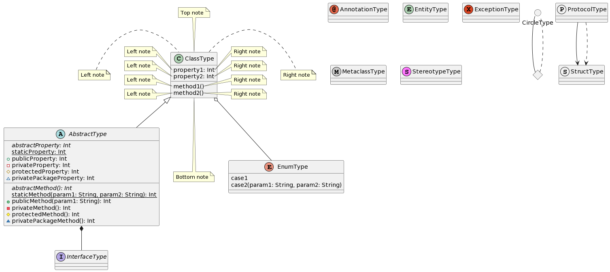

The library allows you to create plantuml via Kotlin DSL.

[](http://www.opensource.org/licenses/mit-license.php)


Library support:
- [ ] Sequence diagram
- [ ] Usecase diagram
- [x] Class diagram
- [ ] Object diagram
- [ ] Activity diagram
- [ ] Component diagram
- [ ] Deployment diagram
- [ ] State diagram
- [ ] Timing diagram

# Setup
## Gradle
```gradle
// Only DSL
implementation "io.github.pavelannin:kotlin-plantuml-dsl:1.0.0"

// DSL with generator
implementation "io.github.pavelannin:kotlin-plantuml-generator:1.0.1"
```

# Quickstart
## 1. Create dsl
```kotlin
val diagram = classDiagram {
  val abstractClass = abstractClass(name = "AbstractType") {
    property(name = "abstractProperty", type = "Int")  { isAbstract = true }
    property(name = "staticProperty", type = "Int")  { isStatic = true }
    property(name = "publicProperty", type = "Int")  { accessControl = AccessControlUml.Type.Public }
    property(name = "privateProperty", type = "Int")  { accessControl = AccessControlUml.Type.Private }
    property(name = "protectedProperty", type = "Int")  { accessControl = AccessControlUml.Type.Protected }
    property(name = "privatePackageProperty", type = "Int")  { accessControl = AccessControlUml.Type.PrivatePackage }

    method(name = "abstractMethod", returnType = "Int")  {
      isAbstract = true
    }
    method(name = "staticMethod", returnType = "Int")  {
      isStatic = true
      argument(name = "param1",  type = "String")
      argument(name = "param2",  type = "String")
    }
    method(name = "publicMethod", returnType = "Int")  {
      accessControl = AccessControlUml.Type.Public
      argument(name = "param1",  type = "String")
    }
    method(name = "privateMethod", returnType = "Int")  {
      accessControl = AccessControlUml.Type.Private
    }
    method(name = "protectedMethod", returnType = "Int")  {
      accessControl = AccessControlUml.Type.Protected
    }
    method(name = "privatePackageMethod", returnType = "Int")  {
      accessControl = AccessControlUml.Type.PrivatePackage
    }
  }
  val annotation = annotation(name = "AnnotationType")
  val circle = circle(name = "CircleType")
  val `class` = `class`(name = "ClassType") {
    property(name = "property1", type = "Int")  {
      notes { left(text = "Left note") }
      notes { right(text = "Right note") }
    }
    property(name = "property2", type = "Int")  {
      notes { left(text = "Left note") }
      notes { right(text = "Right note") }
    }
    method(name = "method1")  {
      notes { left(text = "Left note") }
      notes { right(text = "Right note") }
    }
    method(name = "method2")  {
      notes { left(text = "Left note") }
      notes { right(text = "Right note") }
    }
    notes {
      left(text = "Left note")
      right(text = "Right note")
      top(text = "Top note")
      bottom(text = "Bottom note")
    }
  }
  val diamond = diamond(name = "DiamondType")
  val entity = entity(name = "EntityType")
  val enum = enum(name = "EnumType") {
    case(name = "case1")
    case(name = "case2") {
      argument(name = "param1",  type = "String")
      argument(name = "param2",  type = "String")
    }
  }
  val exception = exception(name = "ExceptionType")
  val `interface` = `interface`(name = "InterfaceType")
  val metaClass = metaClass(name = "MetaclassType")
  val protocol = protocol(name = "ProtocolType")
  val stereotype = stereotype(name = "StereotypeType")
  val struct = struct(name = "StructType")

  `class` extension abstractClass
  `class` aggregation enum
  abstractClass composition `interface`
  circle solidLine diamond
  diamond dashedLine circle
  protocol directedSolidLine struct
  protocol directedDashedLine struct
}
```

## 2. Creating PlantUml
```kotlin
val plantUmlString = diagram.plantUml()
```

<details>
<summary>Result generated plantuml</summary>


</details>

<details>
<summary>Result plantuml image</summary>


</details>
